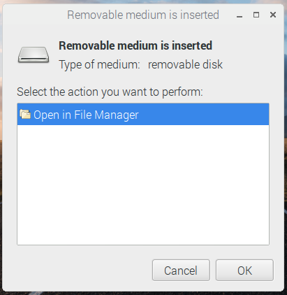
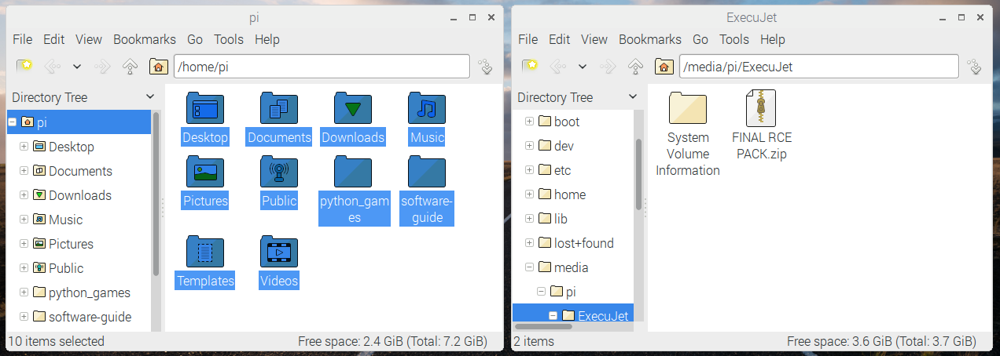
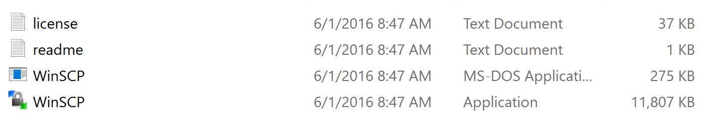
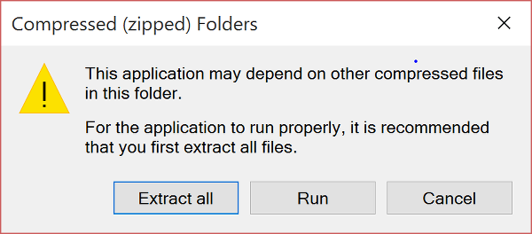
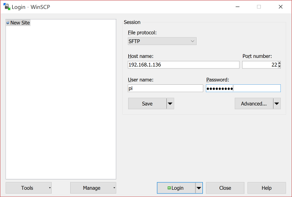
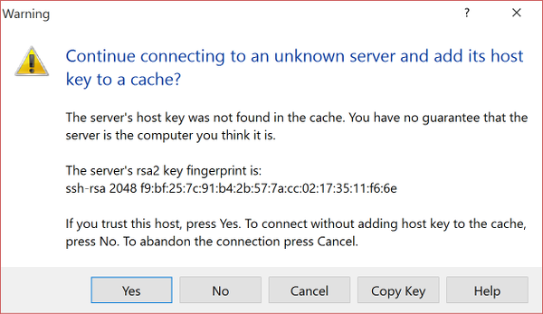
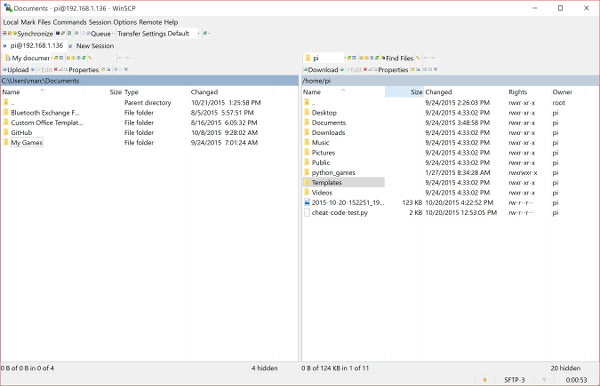
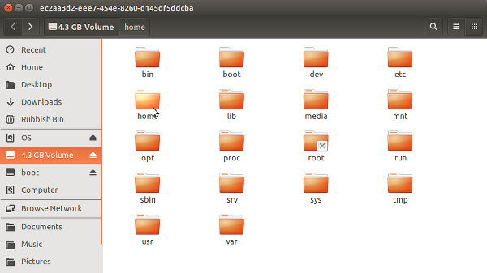
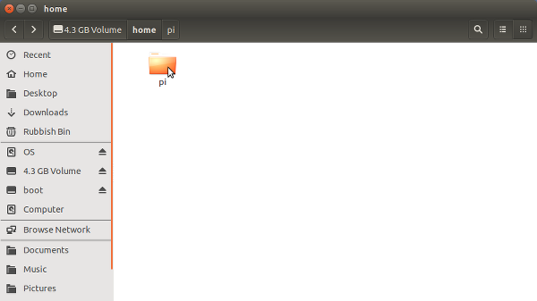

# Backing up your home folder

It's likely that all your important files are in a directory on your SD card called `/home/pi`. This resource assumes this is where you have been keeping your files. If they are elsewhere on your SD card, then you might have to copy them into `/home/pi`.

## Backing up using removable storage

If you have a USB flash drive or a portable hard drive with enough storage, then this is the easiest method to back up your files.

1. Insert your USB drive into one of your Pi's USB ports; it should be recognised straight away.

  

2. Open the USB drive in **File Manager**.
3. Use **File Manager** to open a second window and position it side by side.

  

4. You can now copy the contents of `/home/pi` onto the USB drive.

If you can't copy the files over, it probably means you are using a USB drive that has been formatted to be used with Mac OS X. Try formatting the USB drive with a FAT32 file system, using your Mac's Disk Utility.

## Backing up over a network

You're going to need your Raspberry Pi's IP address to copy files over a network.

1. Boot up your Raspberry Pi, ensure it is connected to the network, and then open up a terminal window.
2. In the terminal type:

  ```bash
  hostname -I
  ```

3. The Raspberry Pi's IP address will be displayed.

### Linux and Mac instructions

4. On your Linux or Mac computer, ensure you are connected to the **same** network as the Raspberry Pi, then open up a terminal window.
5. Now type the following into the terminal, replacing the 10-digit IP address with the one you have taken from the Raspberry Pi:

  ```bash
  rsync -av --exclude".*/" pi@192.168.1.111:/home/pi/ ~/RPi-backup
  ```

6. If you now look in your Mac or Linux machine's home directory, you should see a folder called RPi-backup, containing all your files.

### Windows instructions

1. Ensure your Windows machine is connected to the **same** network as the Raspberry Pi.
1. To copy files over the network to a Windows machine, you'll need to install a program called WinSCP.
2. Go to [the WinSCP download page](http://winscp.net/eng/download.php).
3. Download the portable executable:

  

4. If you check in your Downloads folder, you should see the following files. Double-click on the WinSCP **application** (not the MS-DOS application):

  

5. Double-click the file and then click on **Run**:

  

6. On the next screen, fill in the IP address of the Pi, and the username and password:

  

7. A warning will pop up, asking whether you trust the computer or not. Click on **Yes**:

  

8. The next screen will allow you to transfer files between the machines by dragging and dropping from one pane to another:

  

## Backing up by accessing the SD card on Linux

If you are using a Linux machine, then you can copy the files directly from the SD card.

1. Shut down the Raspberry Pi, remove the micro SD card, and place it into an SD card adapter. Then insert this into your machine.
2. The screenshot below shows the SD card mounted on a machine running Ubuntu:

  

3. You files will be in `home/pi`, so double-click on the `home` directory and copy the entire `pi` directory to your local machine:

  

Click on the link to go back to [Installing Raspbian with NOOBS](worksheet.md).

## What next?

- Return to the [Quick Start Guide](worksheet.md)
- Learn how to [update your SD card](update-sd-card.md)
- Install more [applications](install-apps.md)
- Connect to [WiFi](wifi.md)
